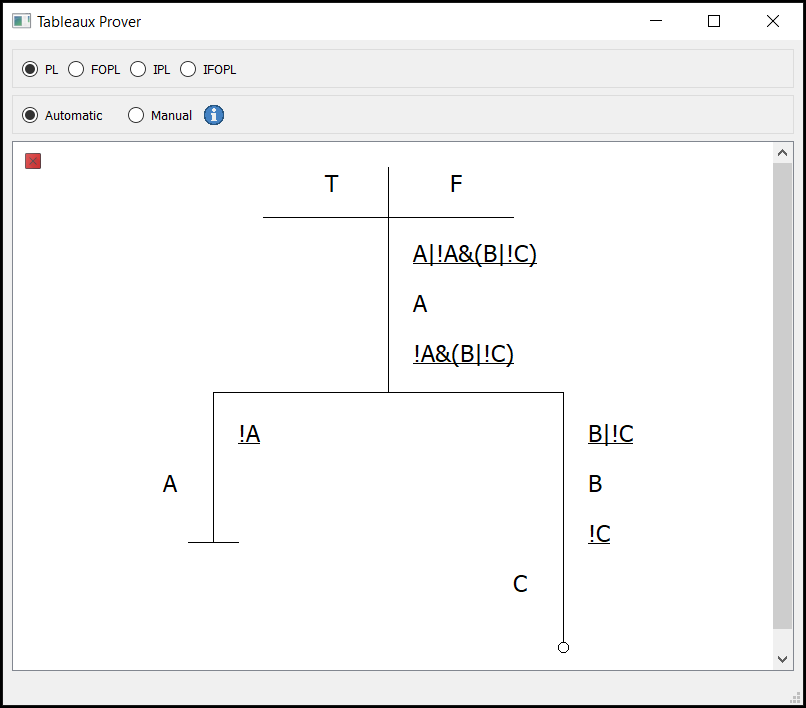
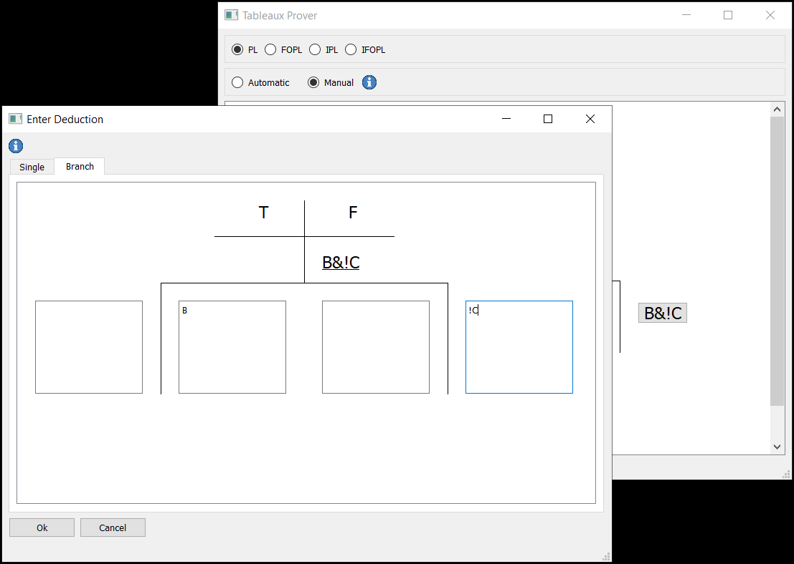

# Whats this?
This tableaux prover aims to prove tableaux in different logics as a learning tool. The tableaux can be proven in automatic or manual mode. In manual mode the user has to perform each step manually and gets feedback about the correctness of his derivations.

Screenshot automatic mode:

Screenshot manual mode:

The syntax reference can be found by clicking at the info button.

# Requirements
- Python Version >= 3.7.2
- Packages, see [requirements.txt](requirements.txt)

# Folder Structure
- [Source Code src/](src/)
- [Seminar Paper docs/](docs/)
- [Unittests tests/](tests/)
- [Antlr Generated Files gen/](gen/)
- [.ui Concept Files ui_concepts/](ui_concepts/)

The main entry point of the programm is the file [src/main.py](src/main.py)
